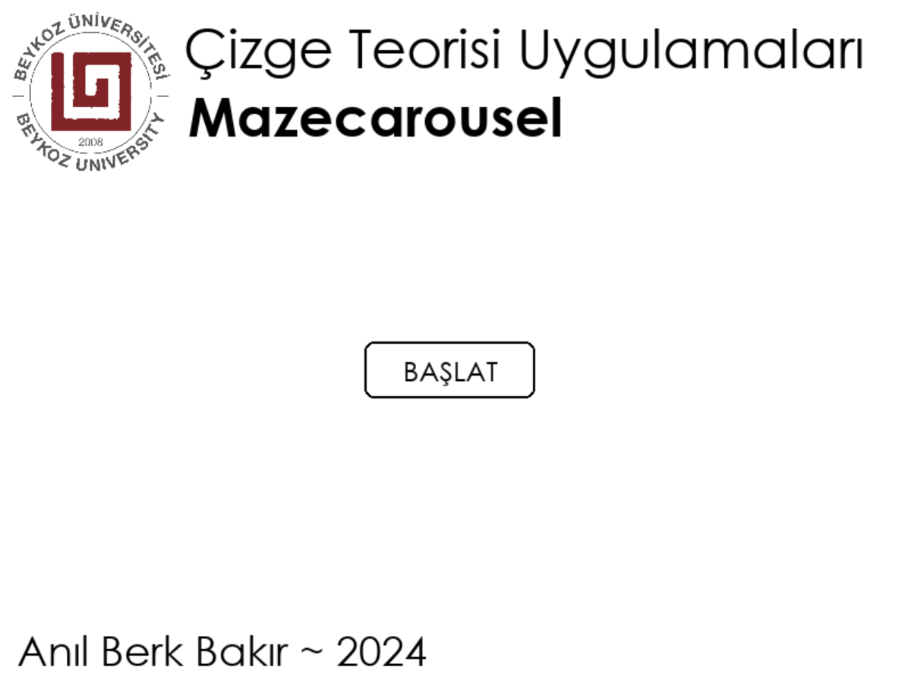

# Graph Theory Applications Term Project ~ Mazecarousel
Mazecarousel is a desktop application which randomly generates labyrinths from scratch, and determines the shortest path between two nodes.

Mazecarousel consists of three main screens;
* Labyrinth Generation Screen - The application generates a labyrinth based on a user-determined seed value. If the user hasn't determined any, the application generates a random number to use as the seed. Then a random labyrith is generated based on the seed and hardcoded size values for the labyrith. Recursive Backtracking algorithm is used for generating a labyrinth.

* Graph Labyrinth Screen - The previously-generated labyrinth gets rendered as a generic graph. Each tile in the labyrinth represents a node in the graph view, and each wall shows whether or not there's a connection between said tiles. If there's a wall between two tiles, then there's no connection in the graph view.

* Path Finding Screen - The user chooses two tiles as Start and Exit, which then the application finds the shortest path between each tile. The path is then rendered onto the screen. Given that there's only one exit, Depth-First Search algorithm is used.

Mazecarousel was developed as a term project for Beykoz University ~ Graph Theory Applications class, using Python language and Pygame library on Spyder.